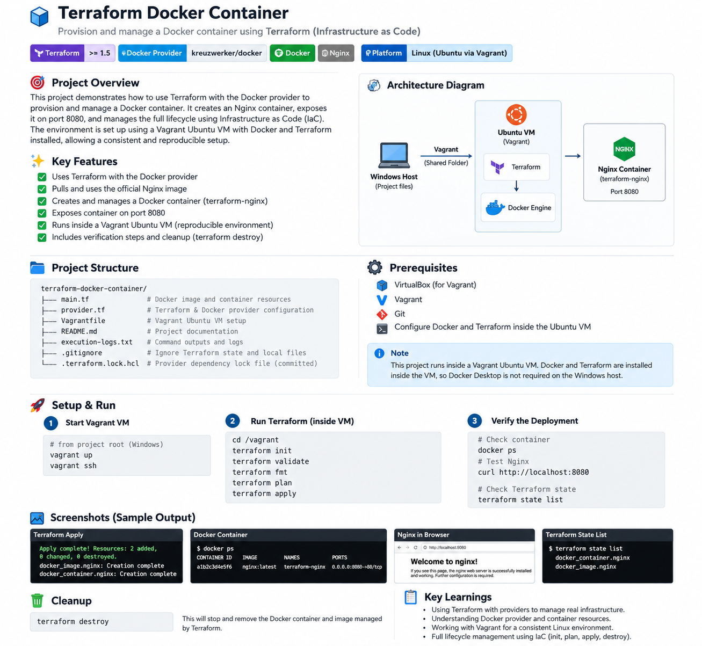

# Terraform Docker Container

A hands-on **Infrastructure as Code (IaC)** project that provisions and manages a local Docker container using **Terraform** and the **Docker provider**.

The project runs inside an **Ubuntu 22.04 (Jammy) Vagrant VM**, where Terraform communicates directly with the Docker Engine. An Nginx container is provisioned, exposed on port `8080`, verified using Terraform state and Docker commands, and finally destroyed using Terraform.

<p align="center">
  
</p>

---

## Project Objective

The objective of this project is to provision a local Docker container using Terraform and demonstrate the complete Infrastructure as Code lifecycle:

```text
Initialize
   ↓
Validate
   ↓
Plan
   ↓
Apply
   ↓
Verify
   ↓
Inspect State
   ↓
Destroy
```

---

## Key Features

- Uses Terraform with the Docker provider
- Runs Docker and Terraform inside an Ubuntu Vagrant VM
- Pulls the official `nginx:latest` Docker image
- Creates a Docker container named `terraform-nginx`
- Maps container port `80` to host port `8080`
- Verifies infrastructure using `docker ps`
- Verifies Terraform-managed resources using `terraform state list`
- Demonstrates complete IaC lifecycle management
- Keeps Terraform state and local runtime files out of Git

---

## Tech Stack

- **Terraform**
- **Docker**
- **Nginx**
- **Vagrant**
- **VirtualBox**
- **Ubuntu 22.04 LTS**
- **Git**
- **GitHub**

---

## Architecture

```text
Windows Host
     │
     │ Vagrant
     ▼
Ubuntu 22.04 VM
     │
     ├── Terraform
     │      ↓
     │ Docker Provider
     │      ↓
     └── Docker Engine
             ↓
        nginx:latest
             ↓
      terraform-nginx
             ↓
       Port 80 → 8080
             ↓
   http://localhost:8080
```

Terraform and Docker both run inside the Ubuntu VM, so Terraform communicates directly with the Docker daemon through:

```text
unix:///var/run/docker.sock
```

---

## Repository Structure

```text
terraform-docker-container/
│
├── docs/
│   └── images/
│       └── terraform-docker-architecture.png
│
├── Vagrantfile
├── provider.tf
├── main.tf
├── .terraform.lock.hcl
├── .gitignore
├── execution-logs.txt
└── README.md
```

---

## Terraform Provider Configuration

### `provider.tf`

```hcl
terraform {
  required_providers {
    docker = {
      source  = "kreuzwerker/docker"
      version = "~> 3.0"
    }
  }
}

provider "docker" {
  host = "unix:///var/run/docker.sock"
}
```

The Docker provider allows Terraform to communicate with the Docker Engine running inside the Ubuntu VM.

---

## Terraform Resources

### `main.tf`

```hcl
resource "docker_image" "nginx" {
  name = "nginx:latest"
}

resource "docker_container" "nginx" {
  name  = "terraform-nginx"
  image = docker_image.nginx.image_id

  ports {
    internal = 80
    external = 8080
  }
}
```

This configuration creates two Terraform-managed resources:

```text
docker_image.nginx
        ↓
nginx:latest

docker_container.nginx
        ↓
terraform-nginx
```

---

## Vagrant Environment

The project uses an Ubuntu 22.04 Vagrant VM so Docker and Terraform can run in a Linux environment without requiring Docker Desktop on Windows.

Example `Vagrantfile`:

```ruby
Vagrant.configure("2") do |config|

  config.vm.box = "ubuntu/jammy64"
  config.vm.hostname = "terraform-docker"

  config.vm.network "forwarded_port",
    guest: 8080,
    host: 8080

  config.vm.provider "virtualbox" do |vb|
    vb.memory = "2048"
    vb.cpus = 2
  end

end
```

Start the VM:

```bash
vagrant up
```

Connect:

```bash
vagrant ssh
```

Move to the mounted project directory:

```bash
cd /vagrant
```

---

# Terraform Workflow

## 1. Initialize Terraform

```bash
terraform init
```

Terraform downloads the required Docker provider and initializes the working directory.

Expected result:

```text
Terraform has been successfully initialized!
```

---

## 2. Validate the Configuration

```bash
terraform validate
```

Expected result:

```text
Success! The configuration is valid.
```

---

## 3. Format Terraform Files

```bash
terraform fmt
```

This applies Terraform's standard formatting to the configuration files.

---

## 4. Preview the Infrastructure

```bash
terraform plan
```

Expected result:

```text
Plan: 2 to add, 0 to change, 0 to destroy.
```

Terraform plans to create:

```text
docker_image.nginx
docker_container.nginx
```

---

## 5. Provision the Infrastructure

```bash
terraform apply
```

Enter:

```text
yes
```

Expected result:

```text
Apply complete! Resources: 2 added, 0 changed, 0 destroyed.
```

Terraform performs the following:

```text
Pull nginx:latest
       ↓
Create Docker image resource
       ↓
Create terraform-nginx container
       ↓
Expose port 80
       ↓
Map host port 8080
```

---

## 6. Verify the Docker Container

Check the running container:

```bash
docker ps
```

Expected container name:

```text
terraform-nginx
```

Test from the VM:

```bash
curl http://localhost:8080
```

Or open from the Windows host:

```text
http://localhost:8080
```

The Nginx welcome page confirms that the Terraform-created container is running successfully.

---

## 7. Verify Terraform State

```bash
terraform state list
```

Expected:

```text
docker_container.nginx
docker_image.nginx
```

This confirms Terraform is tracking both the Docker image and the Docker container.

---

## 8. Destroy the Infrastructure

```bash
terraform destroy
```

Enter:

```text
yes
```

Terraform removes the resources it created.

Verify:

```bash
terraform state list
docker ps
```

The `terraform-nginx` container should no longer appear.

---

## Terraform Lifecycle

```text
terraform init
      ↓
terraform validate
      ↓
terraform fmt
      ↓
terraform plan
      ↓
terraform apply
      ↓
docker ps
      ↓
terraform state list
      ↓
terraform destroy
```

This demonstrates the complete Terraform lifecycle for local Docker infrastructure.

---

## Terraform State

Terraform stores information about the infrastructure it manages in:

```text
terraform.tfstate
```

The state file connects the Terraform configuration to the real Docker resources.

```text
main.tf
   ↓
Terraform State
   ↓
Docker Engine
   ↓
terraform-nginx
```

The Terraform state file is intentionally excluded from Git.

---

## `.gitignore`

```gitignore
.terraform/
*.tfstate
*.tfstate.*
crash.log
*.tfvars
```

### Files committed to Git

```text
Vagrantfile
provider.tf
main.tf
.terraform.lock.hcl
.gitignore
execution-logs.txt
README.md
docs/images/terraform-docker-architecture.png
```

### Files excluded from Git

```text
.terraform/
terraform.tfstate
terraform.tfstate.*
*.tfvars
```

---

## Execution Logs

The assignment requires execution logs, so this repository includes:

```text
execution-logs.txt
```

Useful commands to capture:

```bash
terraform init
terraform validate
terraform fmt
terraform plan
terraform apply
terraform state list
docker ps
curl http://localhost:8080
terraform destroy
```

---

## Project Evidence

Recommended screenshots:

```text
docs/images/
├── terraform-init.png
├── terraform-plan.png
├── terraform-apply.png
├── docker-ps.png
├── terraform-state-list.png
├── nginx-localhost.png
└── terraform-destroy.png
```

Example:

```markdown

```

---

## What I Learned

This project helped me understand:

- Infrastructure as Code fundamentals
- Terraform provider configuration
- Terraform resource blocks
- Docker provider usage
- Terraform initialization
- Terraform validation and formatting
- Terraform execution plans
- Terraform apply and destroy workflows
- Docker image provisioning with Terraform
- Docker container provisioning with Terraform
- Port mapping
- Terraform resource dependencies
- Terraform state management
- Running Terraform and Docker inside a Linux VM
- Using Vagrant as a reusable local DevOps lab environment

---

## Terraform Concepts Practiced

### Provider

A provider allows Terraform to communicate with an external platform.

```hcl
provider "docker" {
  host = "unix:///var/run/docker.sock"
}
```

### Resource

A resource defines infrastructure Terraform should create and manage.

```hcl
resource "docker_container" "nginx" {
}
```

### Dependency

The Docker container depends on the Docker image:

```hcl
image = docker_image.nginx.image_id
```

Terraform automatically understands that the image must exist before the container can be created.

### State

Terraform tracks managed resources through its state:

```bash
terraform state list
```

### Destroy

Terraform can remove the infrastructure it created:

```bash
terraform destroy
```

---

## Future Improvements

Possible next steps:

- Add Terraform variables
- Add Terraform outputs
- Create a Docker network using Terraform
- Add persistent Docker volumes
- Deploy multiple containers
- Use a custom Node.js application image
- Add container health checks
- Use `terraform.tfvars`
- Create reusable Terraform modules
- Integrate Terraform into Jenkins
- Integrate Terraform into GitHub Actions

---

## Author

**Ambuj Mishra**

GitHub: **ambujmishra1997**
